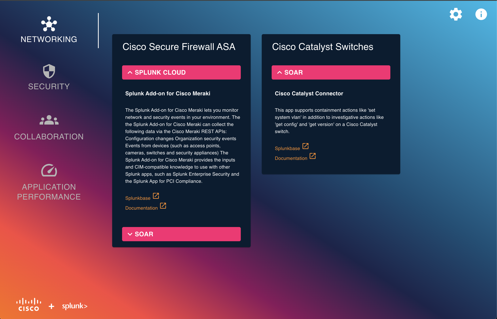
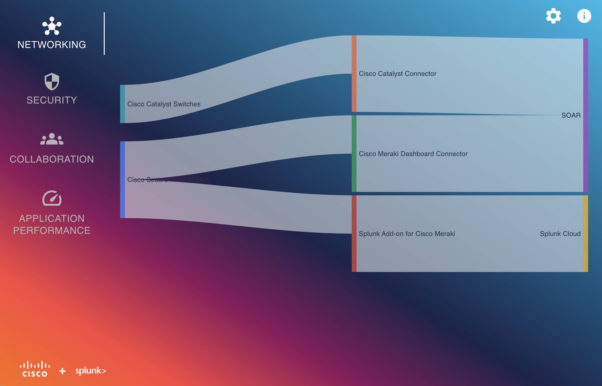
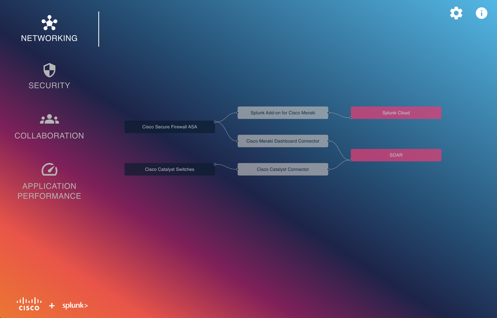

# Cisco and Splunk Infographic Landscape

Splunk and Cisco Landscape | products, apps, integrations, and overall better together story for a visual learner!


## Features
* Tabs navigation to filter integrations per category: `Networking`, `Security`, `Collaboration` and `Application Performance`
* Three layouts showcasing products integration per category
    * Card Layout
    * Sankey Layout
    * Flow Layout
* Layout selection via `Settings`
* Products integrations data is defined in a JSON file used for loading visualizations

<table>
    <tr>
        <td colspan="3">
            <b>Card Layout</b>
        </td>
  </tr>
  <tr>
    <td>
        <b>Sankey Layout</b>
    </td>
    <td>
        <b>Flow Layout</b>
    </td>
  </tr>
</table>

## Usage
This project is **not yet publically available**. We are still looking for the best fitting place for it.

To run the app locally, please follow [instructions](CONTRIBUTING.md#development-environment-setup)

## Technical Specifications


### Technologies Used
- **React**: A JavaScript library for building user interfaces.
- **Google Charts**: A powerful, simple to use, and free tool for data visualization.
- **React Flow**: A library for building interactive node-based applications.
- **MUI**: A popular React UI framework for building responsive web applications.

### JSON Data Structure: single integration
To interact with our API, each integration should follow this JSON structure:

```json
{
    "category": "Networking",
    "cisco_product": "Cisco Secure Firewall ASA",
    "cisco_product_description": "The Cisco Secure Firewall ASA provides protection to devices within corporate networks and data centers of all sizes.",
    "splunk_addon": "Splunk Add-on for Cisco Meraki",
    "splunk_platform": "Splunk Cloud ",
    "link": "https://splunkbase.splunk.com/app/5580",
    "documentation": "https://docs.splunk.com/Documentation/AddOns/released/Meraki/AboutAddon",
    "description": "The Splunk Add-on for Cisco Meraki lets you monitor network and security events in your environment. The the Splunk Add-on for Cisco Meraki can collect the following data via the Cisco Meraki REST APIs: Configuration changes Organization security events Events from devices (such as access points, cameras, switches and security appliances)\n\nThe Splunk Add-on for Cisco Meraki provides the inputs and CIM-compatible knowledge to use with other Splunk apps, such as Splunk Enterprise Security and the Splunk App for PCI Compliance.",
    "comments": ""
},
```

### Fields Description
Fields are **ALL required**. Empty values may be accepted.


| Field | Type | Description | Example Value |
|:---:|---|---|---|
| `category` | String | Available options: "Networking", "Security", "Collaboration", "Application Performance" | Networking |
| `cisco_product` | String | Name of Cisco Product | Cisco Secure Firewall ASA |
| `cisco_product_description` | String | Description of Cisco Product | This product provides protection to devices within corporate networks |
| `splunk_addon` | String | Name of Splunk Add-On | Splunk Add-on for Cisco Meraki |
| `splunk_platform` | String | Available options: "SOAR", "Splunk Cloud" | Splunk Cloud |
| `link` | URL | Link to Splunkbase | https://splunkbase.splunk.com/app/5580 |
| `documentation` | URL | Link to Add-On documentation | https://docs.splunk.com/Documentation/AddOns/released/Meraki/AboutAddon |
| `description` | String | Description of Splunk Add-On | The Splunk Add-on for Cisco Meraki lets you monitor network and security events in your environment. |
| `comments` | String | Eventual comments |  |


## Contributing
Please read our [CONTRIBUTING.md](CONTRIBUTING.md) guidelines for details on how to contribute to this project.

## License
This project is licensed under the Apache 2.0 – see the [LICENSE](LICENSE) file for details.

## Inspirations
This project was inspired by several resources and projects:

* [Jason Conger's Azure <--> Splunk Sanky diagram](https://jasonconger.com/splunk-azure-gdi/)
* Cloud Native Computing Foundation (CNCF) has a special place in my heart and their [landscape feature](https://landscape.cncf.io/) is just amazing at navigating the ecosystem

We appreciate the work of these individuals and communities that deeply influenced our design! :heart:
